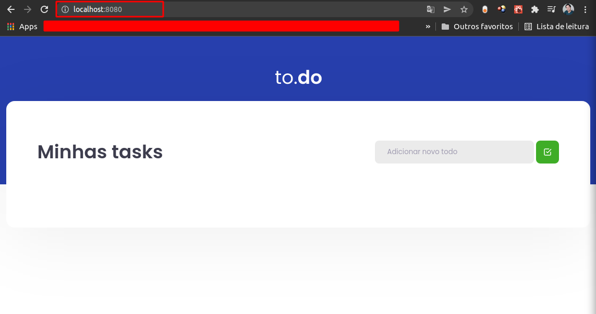
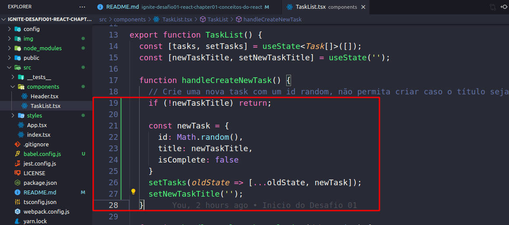

<h1 align="center">
  
</h1>

# ignite-desafio01-react-chapter01-conceitos-do-react
Desafio 01 - Conceitos do React

Nesse desafio foi criado uma aplicação para manipulação do estado no React.

Vamos inicia com:
`yarn dev`

Vamos no Browser e digitamos:
`localhost:8080`

<h1 align="center">
  
</h1>

### should be able to add a task
deve ser capaz de adicionar uma tarefa

Vamos observa o codigo a baixo e verificar onde está o input e verificar como ele funciona:
Encontramos dentro de `values` o valor do imput.
Observe que o valor `newTaskTitle` esta sendo setado no estado e o valor dele sempre sera salvo no newTaskTitle.

Vamos fazer um if, a newTaskTitle com `!`, ficando assim:
`if (!newTaskTitle)` que quer dizer que se tiver alguma coisa dentro do imput ele sera true e vai me trazer um return empedindo o resto da execusão, e ele não ira criar uma task vazia:
`if (!newTaskTitle) return;`

Agora precisamos salva a task
Para isso vamos criar um estado temporario com os valores id, title, isComplete `const newTask`.
E o `Math.random` vai gera um numero aleatorio.
`isComplete` precisa vim vazia.
E setamos com `setTasks` sendo usado com calbak, onde eu consigo pega o valor antigo com o `oldState`.
Como o task tem formato de arrey e precisa ser adcionado um item a amais no array sem retira o valor antigo.
Enão vamos usa o spread operation `...` que ele pega todos os valores que existia antigamente.
E usar o `setNewTaskTitle` e reseta para o começo, e sempre que adiciona uma novo nome ele vai reseta para o começo.

```
const newTask = {
  id: Math.random(),
  title: newTaskTitle,
  isComplete: false
}
setTasks(oldState => [...oldState, newTask]);
setNewTaskTitle('');
```

<h1 align="center">
  
</h1>


### Teste TaskList.spec.tsx

- **should be able to add a task**

Para que esse teste passe, você deve permitir que task seja criada e com isso, exibida em tela. As taks criadas devem conter os atributos seguindo o padrão da interface, que é:

```tsx
interface Task {
  id: number;
  title: string;
  isComplete: boolean;
}
```

- **should not be able to add a task with an empty title**

Para que esse teste passe, antes de criar uma nova task, você deve validar se algo foi digitado no input e não permitir a criação da task caso o valor seja vazio, caso o valor digitado seja vazio, você deve impedir a criação da task.

- **should be able to remove a task**

Para que esse teste passe, você deve permitir que ao clicar no botão com ícone de uma lixeira, a task relacionada a esse botão seja removida do estado da aplicação, consequentemente sendo removida da tela.

- **should be able to check a task**

Para que esse teste passe, você deve permitir que ao clicar no checkbox ao lado da task, ela seja marcada como concluída ou não concluída de acordo com seu estado atual, alterando seu valor de `isComplete` de `false` para `true` ou ao contrário, de `true` para `false`.