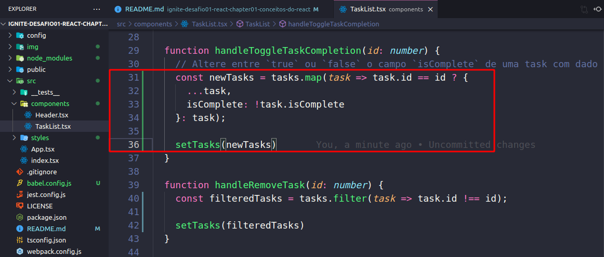
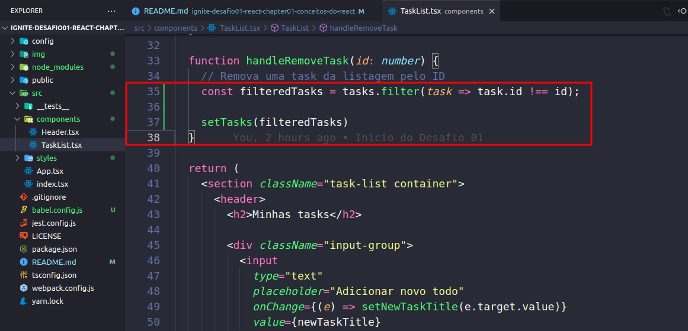
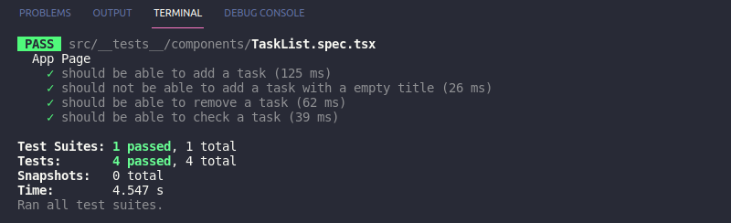

<h1 align="center">
  
</h1>

# ignite-desafio01-react-chapter01-conceitos-do-react
Desafio 01 - Conceitos do React

Nesse desafio foi criado uma aplicação para manipulação do estado no React.

Vamos inicia com:
`yarn dev`

Vamos no Browser e digitamos:
`localhost:8080`

<h1 align="center">
  
</h1>

### Handle Create New Task
Lidar com Criar Nova Tarefa

Vamos observa o código a baixo e verificar onde está o input e verificar como ele funciona:
Encontramos dentro de `values` o valor do imput.
Observe que o valor `newTaskTitle` esta sendo setado no estado e o valor dele sempre sera salvo no newTaskTitle.

Vamos fazer um if, a newTaskTitle com `!`, ficando assim:
`if (!newTaskTitle)` que dizer que se tiver algo dentro do imput ele sera true e vai me trazer um return em pedindo o resto da execução, e ele não ira criar uma task vazia:
`if (!newTaskTitle) return;`

Agora precisamos salva a task
Para isso vamos criar um estado temporário com os valores id, title, isComplete `const newTask`.
E o `Math.random` vai gerar um número aleatório.
`isComplete` precisa vim vazia.
E setamos com `setTasks` sendo usado com calbak, onde eu consigo pega o valor antigo com o `oldState`.
Como o task tem formato de arrey e precisa ser adicionado um ‘item’ a amais no array sem retirar o valor antigo.
Em tão vamos usa o spread operation `...` que ele pega todos os valores que existia antigamente.
E usar o `setNewTaskTitle` e reseta para o começo, e sempre que adiciona um novo nome, ele ira reseta para o começo.

```
const newTask = {
  id: Math.random(),
  title: newTaskTitle,
  isComplete: false
}
setTasks(oldState => [...oldState, newTask]);
setNewTaskTitle('');
```

<h1 align="center">
  
</h1>

### Handle Toggle Task Completion
Lidar com Alternar Conclusão da Tarefa

Essa funcionalidade e um imput de check.
E esta em `checked={task.isComplete}`

Vamos pega a task que foi mapeada e se task for igual task.id então vamos usa um if ternário `?` a ele ira retorna um objeto que sera a nossa nova task.
Ou seja, vamos pega todos os valores antigos dela `...` e edita o `isComplete`, e ele sera negação `!` de `task.isComplete`.
E si o `task.id` for, diferente de id, vamos retor a task como ela estava com `task`.
Finalizando com um `setTasks` passando o `newTasks` assim:  
```
const newTasks = tasks.map(task => task.id == id ? {
  ...task,
  isComplete: !task.isComplete
}: task);

setTasks(newTasks)
```

<h1 align="center">
  
</h1>

### Handle Remove Task
Lidar com Remover Tarefa

Para se remover a task pelo id, precisamos ir ao estado e procura pela task que tem esse id e remover ela.
Vamos desce no código e ver onde esta o button remove e ver como ele esta sendo nomeado, aqui esta como: `handleRemoveTask`

Onde eu vou retor todas as task que diferirem do id. 
`const filteredTasks = tasks.filter(task => task.id !== id);` 

E salva no estado novamente:
`setTasks(filteredTasks)`

<h1 align="center">
  
</h1>

E para verificar se tudo esta correto vamos rodar um test.
`yarn test`

<h1 align="center">
  
</h1>


### Teste TaskList.spec.tsx

- **should be able to add a task**

Para que esse teste passe, você deve permitir que task seja criada e com isso, exibida em tela. As taks criadas devem conter os atributos seguindo o padrão da interface, que é:

```tsx
interface Task {
  id: number;
  title: string;
  isComplete: boolean;
}
```

- **should not be able to add a task with an empty title**

Para que esse teste passe, antes de criar uma nova task, você deve validar se algo foi digitado no input e não permitir a criação da task caso o valor seja vazio, caso o valor digitado seja vazio, você deve impedir a criação da task.

- **should be able to remove a task**

Para que esse teste passe, você deve permitir que ao clicar no botão com ícone de uma lixeira, a task relacionada a esse botão seja removida do estado da aplicação, consequentemente sendo removida da tela.

- **should be able to check a task**

Para que esse teste passe, você deve permitir que ao clicar no checkbox ao lado da task, ela seja marcada como concluída ou não concluída de acordo com seu estado atual, alterando seu valor de `isComplete` de `false` para `true` ou ao contrário, de `true` para `false`.


### Link do Desafio:
https://www.notion.so/Desafio-01-Conceitos-do-React-51e4099a6e2f4d4bae94f9fe75bb769d